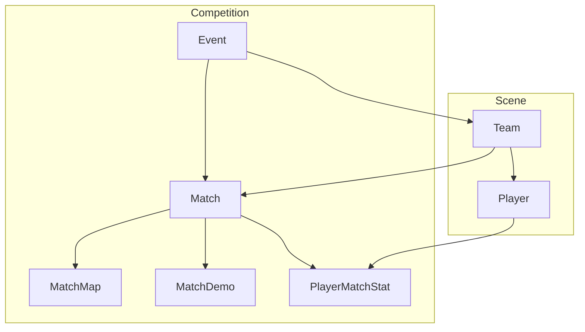

# ByHLTV — схема данных (по доменам)

Читать сверху вниз. Сначала картинка ядра, потом остальные блоки.

**Код схемы:** `packages/database/prisma/schema.prisma`  
**БД:** PostgreSQL · `localhost:5433` · db `byhltv`  
**Картинка ER (бесплатный dbdiagram.io, без Table Group):**

1. Главный слайд → Import `docs/erd/erd-core.dbml` → Export PNG  
2. Роли / TO → Import `docs/erd/erd-ops.dbml`  
3. Контент / реклама → Import `docs/erd/erd-cms-ads.dbml`  
4. Всё сразу (тяжелее) → `docs/schema.dbml` (без платных TableGroup)

Платный «Table Group / Detail Levels» на dbdiagram **не нужен** — вместо групп три отдельных файла.

---

## Как смотреть, чтобы не путаться

Схема разбита на **6 доменов**. Не пытайся держать все 40 таблиц в голове сразу.

| # | Домен | Смысл | Главные таблицы |
|---|--------|--------|-----------------|
| 1 | **Auth** | кто залогинен | User, Session |
| 2 | **Scene** | кто играет | Team, Player, awards, ranking |
| 3 | **Competition** | что играют | Event, Match, maps, demos, stats |
| 4 | **Ops** | как TO/staff работают | заявки, organizers, submissions |
| 5 | **CMS / community** | контент и общение | news, forum, gallery, comments |
| 6 | **Product** | фичи поверх сцены | fantasy, betting, ads |

На слайд заказчику обычно хватает **домена 2 + 3**. Остальное — приложения.

---

## Ядро (то, что рисуют первым)

```
Team ──< Player
  │
  └──< EventTeam >── Event ──< Match ──┬──< MatchMap
                                       ├──< MatchDemo
                                       └──< PlayerMatchStat >── Player
```

Словами:
1. Есть **команды** и **игроки**.
2. Есть **ивент** (сезон/турнир), в него входят команды.
3. На ивенте играют **матчи**.
4. У матча есть **карты**, опционально **демка**, и **стата игроков по карте**.
5. Стата матчей копит карьеру на **Player** (rating, kd, adr…).

Live: CS2 GSI пишет в Match / rounds.  
После карты: `.dem` → MatchDemo → PlayerMatchStat.

---

## Домен 1 — Auth

```
User 1──* Session
User.role = USER | EDITOR | MODERATOR | TOURNAMENT_ADMIN | ADMIN | SUPERADMIN
```

Права не «размазаны по if»: смотри `packages/shared/src/permissions.ts` → `can(role, capability)`.

---

## Домен 2 — Scene

```
Team 1──* Player
Player *──* Team          через PlayerTeamHistory (joinedAt / leftAt)
Player 1──* SceneAward    (MVP, EVP, TOP20, HALL_OF_FAME) → optional Event
Team|Player ── RankingSnapshot  (снимок места)
```

| Таблица | Поля, которые важны |
|--------|---------------------|
| Team | slug, name, shortName, logo, ranking, points, region |
| Player | nickname, photoUrl, steamId, teamId, rating/kd/adr/kast, mapsPlayed |
| PlayerTeamHistory | playerId, teamId, joinedAt, leftAt |
| SceneAward | kind, year, rank, playerId, eventId |
| RankingSnapshot | kind (team/player), rank, points, rating |

---

## Домен 3 — Competition

```
Event 1──* EventTeam *──1 Team
Event 1──* Match
Event 1──* BracketNode ──? Match

Match ── team1Id → Team
Match ── team2Id → Team
Match 1──* MatchMap
Match 1──* MapVeto
Match 1──* MatchRound
Match 1──* MatchEvent
Match 1──* MatchDemo ── uploadedBy → User
Match 1──* PlayerMatchStat *──1 Player
```

| Таблица | Зачем |
|--------|--------|
| Event | сезон/LAN (даты, prize, status, cover) |
| EventTeam | кто участвует + seed |
| BracketNode | сетка → матч |
| Match | пара команд, счёт, LIVE/FINISHED, gsiToken |
| MatchMap | счёт по карте |
| MapVeto | ban/pick |
| MatchRound | раунды live |
| MatchEvent | лог GSI |
| MatchDemo | файл `.dem` + статус парса |
| PlayerMatchStat | K/D/A, ADR, rating на карте |

Уникальность статы: `(matchId, playerId, mapName)`.

---

## Домен 4 — Ops

```
User ──> TournamentAdminApplication ──(approve)──> role TOURNAMENT_ADMIN
User + Event ── EventOrganizer
User ── EventSubmission ──(review)── Editor/Admin
StaffMessage ── к submission или application
```

Это не «ещё матчи», это **процесс работы людей**.

---

## Домен 5 — CMS / community

```
User ──* NewsArticle 1──* NewsTranslation (be|ru|en)
Comment → NewsArticle или Match
ForumCategory 1──* ForumThread 1──* ForumPost
GalleryAlbum 1──* GalleryImage   (album → Event или Team)
Stream (каталог ссылок)
Report / Notification / Favorite → User
```

---

## Домен 6 — Product

```
Event ── FantasyLeague 1──* FantasyTeam 1──* FantasyPick → Player
Match ──* BettingOdd
BettingGuide (отдельные тексты)
Ad 1──* AdPlacement (slot)
Ad 1──* AdStatDaily (impressions, clicks)
FeatureFlag, AuditLog
```

Betting у нас **информационный**, не платёжный шлюз.

---

## ER ядра (Mermaid) — для Notion / README



Полный граф со всеми FK: dbdiagram + `docs/schema.dbml` (там TableGroup по доменам — можно сворачивать блоки).

---

## Как сделать понятную картинку (бесплатно)

dbdiagram.io на free **блокирует Table Group**. Не покупай план ради этого.

1. https://dbdiagram.io → New  
2. Import **`docs/erd/erd-core.dbml`** — это ядро (Team/Player/Event/Match/Demo/Stat)  
3. Export → PNG для презентации  
4. При необходимости отдельно импортируй `erd-ops.dbml` и `erd-cms-ads.dbml`  
5. Полный файл без групп: `docs/schema.dbml`

---

## Потоки (одна строка каждый)

| Поток | Цепочка таблиц |
|-------|----------------|
| Публикация новости | User → NewsArticle → NewsTranslation |
| Матч на сайте | Event → Match → MatchMap |
| Live | GSI → Match (+ MatchRound/MatchEvent) → WS клиентам |
| Демка | User → MatchDemo → PlayerMatchStat → поля Player |
| TO | User → TournamentAdminApplication → EventOrganizer → MatchDemo/GSI |
| Реклама | User → Ad → AdPlacement → AdStatDaily |

---

## Roadmap по данным / инфре

1. Postgres (уже) + бэкапы в проде  
2. `prisma migrate` вместо вечного `db push`  
3. S3/MinIO для uploads и `.dem`  
4. Автозабор демок из Telegram  
5. Опционально: Twitch status, Steam login  

---

## Команды

```bash
docker compose up -d postgres
npm run db:generate
npm run db:push
npm run db:seed
npm run db:studio --workspace=@byhltv/database
```

Studio = живые таблицы в браузере, удобно сверять с ER.
